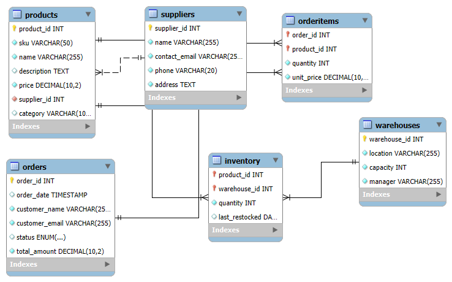

# Inventory Management System  
**Database for Product Tracking and Order Management**

## 📖 Description  
This project provides a complete relational database solution for inventory management, built using MySQL. It enables businesses to:  

- Track products, suppliers, and warehouse locations  
- Manage stock levels across multiple warehouses  
- Process customer orders with detailed line items  
- Monitor supplier relationships and product origins  

Key Features:  
✅ Normalized database structure with 6 core tables  
✅ Inventory tracking with multi-warehouse support  
✅ Order management system with status tracking  
✅ Sample dataset for immediate testing  

## 🛠️ Setup & Installation Guide
Prerequisites
- MySQL Server installed  [Download MySQL](https://dev.mysql.com/downloads/mysql)

- MySQL client CLI or GUI like [MySQL Workbench](https://www.mysql.com/products/workbench)

- The inventory_system.sql file from this project
 

### Database Setup:  
Step 1. **Create a new database**  
    - Open your MySQL client (CLI or GUI).
    - CREATE DATABASE Inventory_db; 
  
Step 2. **Import the SQL file**
#### Option 1: Command Line 
- Open a terminal.
- Navigate to the directory containing inventory_system.sql.
- Run: 
 *mysql -u [your_mysql_username] -p inventory_db < inventory_system.sql *

  - Replace [your_mysql_username] with your MySQL username (e.g., root).

  - Enter your MySQL password when prompted.

#### Option 2: MySQL Workbench (GUI)
1. Open MySQL Workbench and connect to your server.
2. Click File → Open SQL Script and select inventory_system.sql.
3. Select the entire script (Ctrl + A), then execute it (Ctrl + Shift + Enter).
4. Refresh the schema list to see inventory_db.

Step 3: Verify the database
USE inventory_db;
SHOW TABLES;

# 📊 Technical Specifications
- Core Tables:

- Suppliers: Vendor information

- Products: Item details with SKU tracking

- Warehouses: Storage locations with capacity

- Inventory: Stock levels per product/warehouse

- Orders: Customer purchase records

- OrderItems: Detailed order line items

## Technologies Used:

- MySQL 8.0+

- Standard SQL (DDL/DML)

## Constraints & Features:

- Primary/Foreign key relationships

- Quantity check constraints

- ENUM types for order status

- Auto-incrementing IDs

- Unique SKU/product email enforcement

✅ Sample Data Included
The database includes sample records for:

- 3 product categories

- 2 suppliers

- 2 warehouses

- 3 products

- Initial stock levels

- 2 purchase orders with items

## 🤝 Contributing
Contributions are welcome! 

1. Fork this repository; 
[Inventory Repo](https://github.com/Nyandoya/db-wk-8-Nyandoya.git)

2. Create a new branch: git checkout -b branch/YourBranch
3. Commit your changes: git commit -m 'Add YourMessage
4. Push to your branch: git push origin branch/YourBranch
5. Open a pull request.

# ERD for the Database

Thank You!